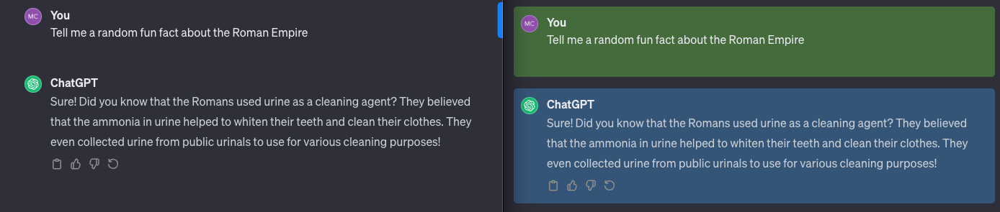

# ChatGPTStyler

## Description

ChatGPTStyler is a Google extension to customize and improve upon the existing ChatGPT website. It is built to enhance ChatGPT's functionality by making it easier for user's to view messages between the user and ChatGPT's response with easily defined text areas.


## Features

-   Chat messages are separated by color, like text messages; user messages are green and ChatGPT messages are blue
-   Widened message area to extend to the width of the screen

## Preview


## Installation

# ChatGPTStyler

## Description

Google extension to customize and improve on the existing ChatGPT website. Built to enhance on ChatGPT's functionality by making it easier for user's to view messages and interact with the web application.

## Features

-   User message area enclosed in green
-   ChatGPT message area enclosed in blue
-   Widened message area to extend to the width of the screen and utilize the available space

## Preview


## Installation

Run the following commands to install dependencies and start developing

1. Clone the repository.

```
https://github.com/joseph-w-valdez/chatGPTStyler
```

2. Install all dependencies with NPM.

```
npm install
```

3. Start the project.

```
npm run dev
```

4. In [Google Chrome](https://www.google.com/chrome/), open up [chrome://extensions](chrome://extensions) in a new tab. Make sure the `Developer Mode` checkbox in the upper-right corner is turned on. Click `Load unpacked` and select the `dist` directory in this repository - your extension should now be loaded.

## Technologies

-   React
-   TypeScript
-   Tailwind

## System Requirements

-   Node 14.11.8
-   React 17.0.2
-   Web Extension Polyfill 0.9.0
-   TypeScript 4.5.4

## Contact

-   Please submit any bugs through issues on the repository

[]()
[]()
[]()
[](https://github.com/aeksco/react-typescript-web-extension-starter/graphs/contributors)
[](https://github.com/aeksco/react-typescript-web-extension-starter/blob/main/LICENSE)
[](https://github.com/aeksco/react-typescript-web-extension-starter/issues)
[](https://github.com/aeksco/react-typescript-web-extension-starter/commits/master)
[]()
[](http://makeapullrequest.com)

[](http://hits.dwyl.com/aeksco/react-typescript-web-extension-starter)
[](https://twitter.com/intent/tweet?text=https://github.com/aeksco/react-typescript-web-extension-starter)
[](https://twitter.com/aeksco)


:desktop_computer: A Web Extension starter kit built with React, TypeScript, Storybook, EsLint, Prettier, Jest, TailwindCSS, &amp; Webpack. Compatible with Google Chrome, Mozilla Firefox, Brave, and Microsoft Edge.


**Getting Started**

Run the following commands to install dependencies and start developing

1. Download and unzip the dist.zip file.

2. In [Google Chrome](https://www.google.com/chrome/), open up [chrome://extensions](chrome://extensions) in a new tab.

3. Make sure the `Developer Mode` checkbox in the upper-right corner is turned on.

4. Click `Load unpacked`

5. Select the `dist` folder. Your extension should now be loaded.

## Technologies

-   React
-   TypeScript
-   Tailwind
-   Webpack
-   Jest
-   Storybook

## Compatibility

The content script is designed for ChatGPT using Chromium browsers, such as Google Chrome, Brave, and Edge

## License

ChatGPT Styler is under the [MIT License](LICENSE).

## Disclaimer

Use ChatGPTStyler responsibly and respect the rights of ChatGPT owned by its respective copyright holders, as well as ChatGPT's terms of use. The author is not responsible for the misuse or unauthorized use of these scripts.
