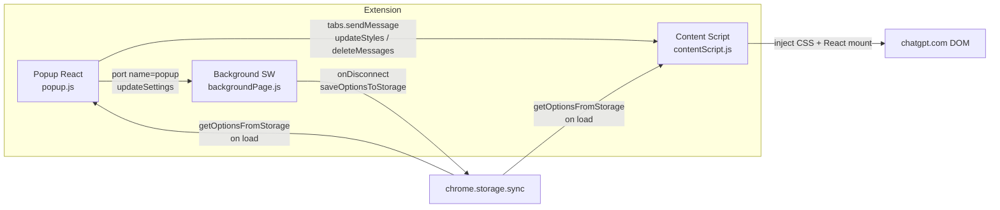
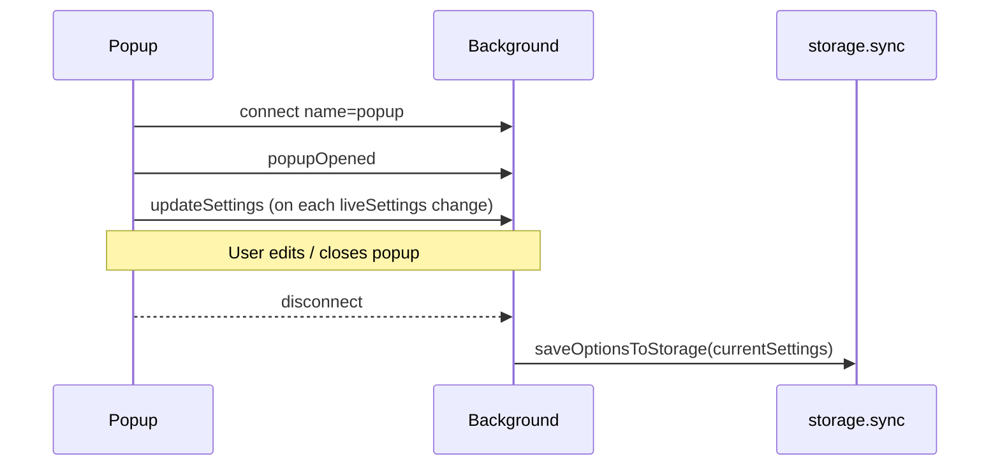

# Architecture

How ChatGPT Styler is structured at runtime. See also [features-and-settings.md](features-and-settings.md) and [dom-integration.md](dom-integration.md).

## High-level diagram



## Manifest V3 wiring

Source of truth in-repo: [`dist/manifest.json`](../dist/manifest.json).

| Manifest field              | Value / meaning                              |
| --------------------------- | -------------------------------------------- |
| `manifest_version`          | `3`                                          |
| `action.default_popup`      | `popup.html` → loads `js/popup.js`           |
| `background.service_worker` | `js/backgroundPage.js`                       |
| `content_scripts`           | `js/contentScript.js` on `*://chatgpt.com/*` |
| `host_permissions`          | `*://chatgpt.com/*`                          |
| `permissions`               | `activeTab`, `storage`                       |

Webpack does **not** copy or generate the manifest. Static files under `dist/` (manifest, `popup.html`, icons) are maintained alongside built JS in `dist/js/`.

## Build entry points

Defined in [`webpack.common.js`](../webpack.common.js):

| Entry key        | Source                                              | Output                      |
| ---------------- | --------------------------------------------------- | --------------------------- |
| `backgroundPage` | [`src/backgroundPage.ts`](../src/backgroundPage.ts) | `dist/js/backgroundPage.js` |
| `popup`          | [`src/popup/index.tsx`](../src/popup/index.tsx)     | `dist/js/popup.js`          |
| `contentScript`  | [`src/contentScript.ts`](../src/contentScript.ts)   | `dist/js/contentScript.js`  |

Shared modules (`@src/...`) are bundled into each entry that imports them. Alias `@src` → `src/`.

Dev vs prod: [`webpack.dev.js`](../webpack.dev.js) (watch + inline source maps) merges into common; [`webpack.prod.js`](../webpack.prod.js) sets `mode: "production"`.

## Module responsibilities

### Popup

-   [`src/popup/index.tsx`](../src/popup/index.tsx) — mounts `<Popup />` into `#popup`, imports global CSS.
-   [`src/popup/component.tsx`](../src/popup/component.tsx) — owns `liveSettings` state, opens a long-lived `runtime.connect({ name: "popup" })` port, loads storage on mount, and posts `liveSettings` changes to the background after the initial load completes. It renders **MessageEditor** (not HomeMenu).
-   Views under [`src/popup/views/messageEditor/`](../src/popup/views/messageEditor/) — active controls.
-   Shared controls under [`src/components/`](../src/components/) — Header, FormButtons, DeleteAllChatsButton, etc.

**Note:** `HomeMenu` and `MiscEditor` are retained in the source tree but are not imported or rendered by the live popup. Multi-page navigation was removed in changelog `1.1.0`; those views remain for tests and possible restoration.

### Background service worker

[`src/backgroundPage.ts`](../src/backgroundPage.ts):

1. Seeds `currentSettings` from storage when the popup connects.
2. Listens for `chrome.runtime.onConnect` with port name `"popup"`.
3. On `message.type === 'updateSettings'`, updates `currentSettings`.
4. On port disconnect (popup closed), saves only after settings have been loaded or received.

This is the intentional “save when popup closes” path. Explicit Save in the UI also writes storage, allowing users to persist immediately without closing the popup.

### Content script

[`src/contentScript.ts`](../src/contentScript.ts):

1. Creates `<style id="custom-style">` in `document.head`.
2. Loads options from storage and sets `customStyle.textContent = updateStyles(settings)`.
3. Listens for runtime messages:
    - `action === "updateStyles"` → replace style text with `request.arg` (CSS string).
    - `action === "deleteMessages"` → run `deleteAllChats()`, respond SUCCESS/FAILURE.
4. Periodically (every 1s) runs layout cleanup (`removeUnnecessarySpace`) and mounts `ScrollToTop` into ChatGPT’s presentation container if missing.

### Shared styling & storage

| Module                                                                        | Role                                                          |
| ----------------------------------------------------------------------------- | ------------------------------------------------------------- |
| [`googleStorage.ts`](../src/lib/utilities/googleStorage.ts)                   | `SettingsType`, get/set `options` under `chrome.storage.sync` |
| [`data.ts`](../src/shared/utils/data.ts)                                      | `defaultSettings`                                             |
| [`stylingFunctions.ts`](../src/shared/utils/stylingFunctions.ts)              | `loadSettings`, `updateStyles`, `sendMessageToTab`            |
| [`deleteAllChats.ts`](../src/lib/utilities/deleteAllChats.ts)                 | Profile menu → Settings → delete-all click sequence           |
| [`removeUnnecessarySpace.ts`](../src/lib/utilities/removeUnnecessarySpace.ts) | Remove Tailwind/layout classes that constrain width           |

## Communication flows

### Live preview (popup → page)

1. User changes a control in MessageEditor / ColorControls / sliders.
2. Control updates React state and calls `sendMessageToTab(settingKey, value)`.
3. `sendMessageToTab` rebuilds the full CSS string via `updateStyles`, then:

    ```ts
    chrome.tabs.query({ active: true, currentWindow: true }, ...)
    chrome.tabs.sendMessage(tabId, { action: "updateStyles", arg: cssTextContent })
    ```

4. Content script writes the string into `#custom-style`.

**Implication:** Live preview only reaches the **active** tab. The ChatGPT tab must be focused when adjusting styles.

### Persist settings

Two paths write `chrome.storage.sync`:

| Path          | Trigger          | Code                                               |
| ------------- | ---------------- | -------------------------------------------------- |
| Explicit Save | FormButtons Save | `saveOptionsToStorage(liveSettings)`               |
| Popup close   | Port disconnect  | Background `saveOptionsToStorage(currentSettings)` |

`saveOptionsToStorage` also broadcasts `{ type: "SETTINGS_CHANGED", payload: options }` to all tabs. The content script **does not** listen for `SETTINGS_CHANGED` today; it only applies styles on load and via `updateStyles` messages. See caveats.

Cancel restores the settings last loaded from storage or explicitly saved during the current popup session. Closing the popup without pressing Save intentionally persists the current live settings.

### Delete all conversations

1. [`DeleteAllChatsButton`](../src/components/deleteAllChatsButton/DeleteAllChatsButton.tsx) confirms, checks active tab URL contains `chatgpt.com`.
2. Sends `{ action: "deleteMessages" }` to that tab.
3. Content script runs `deleteAllChats()` against live DOM and `sendResponse`s status.

### Popup ↔ background port



## Persistence model

-   Key: `options` in `chrome.storage.sync`.
-   Shape: [`SettingsType`](../src/lib/utilities/googleStorage.ts) (string numeric-looking values for widths/padding/radius; hex colors; one boolean for button visibility).
-   Defaults: [`defaultSettings`](../src/shared/utils/data.ts), merged with storage so new/missing keys receive defaults.

## Known implementation caveats

These are **current code realities**, not goals:

1. **Unused navigation UI** — `page` / `setPage` state and Header “Back” exist, but MessageEditor is always shown; HomeMenu/MiscEditor are dead runtime paths.
2. **`SETTINGS_CHANGED` unused** — storage saver notifies tabs with `type: "SETTINGS_CHANGED"`; content script listens for `action: "updateStyles"` / `"deleteMessages"` only. Other tabs/pages do not auto-refresh from that broadcast.
3. **Unmatched handshake messages** — content script sends `{ message: "Content script active" }` expecting `response.reply`, and the popup sends `{ popupMounted: true }` / port `{ popupOpened: true }`. The background has no `runtime.onMessage` handler for those; they are effectively no-ops (aside from port connect).
4. **Intentional dual save paths** — Save writes immediately; closing the popup also persists the current live settings.
5. **Delete button UX vs response** — DeleteAllChatsButton sets success after sending the message and does not reliably wait for / surface the content-script FAILURE response in all cases. Inside `deleteAllChats`, errors thrown from `setInterval` callbacks are outside the outer `try/catch`.
6. **DOM fragility** — Styling and delete-all depend on ChatGPT’s markup (`data-testid`, deep child selectors). Expect breakage when OpenAI ships UI changes; see [dom-integration.md](dom-integration.md).

## Related docs

-   [features-and-settings.md](features-and-settings.md)
-   [development.md](development.md)
-   [../CLAUDE.md](../CLAUDE.md)
