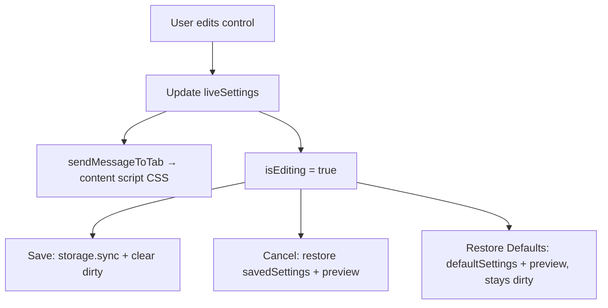

# Features and Settings

User-facing behavior and how settings become CSS on ChatGPT. Architecture context: [architecture.md](architecture.md).

## Active features

| Feature | Where | Behavior |
|---------|-------|----------|
| Message width | MessageEditor sliders | `%` max-width on conversation turns |
| Message padding | MessageEditor sliders | `px` padding on message containers |
| Message border radius | MessageEditor sliders | `px` border-radius |
| Input box width | MessageEditor sliders | `%` max-width on `form` |
| User / ChatGPT bubble colors | ColorControls | Background colors for odd/even turns |
| User / ChatGPT text colors | ColorControls | Text colors for user vs assistant content |
| Restore defaults / Save / Cancel | FormButtons | Reset preview, persist, or revert unsaved edits |
| Delete all conversations | DeleteAllChatsButton | DOM automation on the active ChatGPT tab |
| Scroll to top | Content script + ScrollToTop | Floating button when the thread is scrolled |
| Layout cleanup | `removeUnnecessarySpace` | Removes classes that constrain width / alignment |
| Fixed CSS helpers | `stylingFunctions` | Code-snippet width, transparent edit box, hide default message surface, etc. |

### Retained but inactive UI

- **HomeMenu** — button to open “Message Editor” (multi-page shell no longer used).
- **MiscEditor** — checkbox for `messageButtonsVisibilityStyle` (show/hide chat message buttons). The setting still exists in `SettingsType` / CSS generation, but MiscEditor is not mounted in the live popup.

Changelog `1.1.0` removed home/misc as the default navigation so MessageEditor is the sole popup view.

## Settings model

Defined in [`src/lib/utilities/googleStorage.ts`](../src/lib/utilities/googleStorage.ts):

```ts
interface SettingsType {
  messageMaxWidthStyle: string;
  messageColorUserStyle: string;
  messageColorNonUserStyle: string;
  messagePaddingStyle: string;
  messageBorderRadiusStyle: string;
  inputBoxMaxWidthStyle: string;
  textColorUserStyle: string;
  textColorNonUserStyle: string;
  messageButtonsVisibilityStyle: boolean;
}
```

Defaults in [`src/shared/utils/data.ts`](../src/shared/utils/data.ts):

| Key | Default |
|-----|---------|
| `messageMaxWidthStyle` | `"95"` |
| `messageColorUserStyle` | `"#0084FF"` |
| `messageColorNonUserStyle` | `"#333333"` |
| `messagePaddingStyle` | `"10"` |
| `messageBorderRadiusStyle` | `"5"` |
| `inputBoxMaxWidthStyle` | `"94"` |
| `textColorUserStyle` | `"#FFFFFF"` |
| `textColorNonUserStyle` | `"#FFFFFF"` |
| `messageButtonsVisibilityStyle` | `true` |

Storage key: `options` in `chrome.storage.sync`. Missing storage → clone of `defaultSettings`.

## Live preview vs Save / Cancel / Defaults

State lives in `Popup` as `liveSettings` / `setLiveSettings`, passed into MessageEditor.



### Control behavior

- **Sliders** ([`MessageSliderControls`](../src/popup/views/messageEditor/components/messageSliderControls/component.tsx)): numeric text + range inputs (1–100). Digits only; values capped at 100. Each change calls `sendMessageToTab` and marks editing.
- **Colors** ([`ColorControls`](../src/popup/views/messageEditor/components/colorControl/component.tsx)): HTML color inputs for User and ChatGPT × (BG, Text). Same live-update pattern.
- **FormButtons** ([`FormButtons.tsx`](../src/components/formButtons/FormButtons.tsx)):
  - **Restore Defaults** — set live state to `defaultSettings`, preview via `restoreSettings`, leave `isEditing` true.
  - **Save** — `saveOptionsToStorage(liveSettings)`, copy into `savedSettings`, clear editing.
  - **Cancel** — restore `savedSettings` into live state and preview; clear editing.
- **Background disconnect** — even without clicking Save, closing the popup can persist the last `updateSettings` payload received by the background worker (see architecture caveats).

`savedSettings` inside MessageEditor is initialized from the `liveSettings` prop at first render (defaults) and is only refreshed when the user clicks Save — it is **not** updated when storage finishes loading into `Popup`. Cancel before an explicit Save can therefore restore defaults rather than the previously persisted options (see [architecture caveats](architecture.md#known-implementation-caveats)).

## CSS generation

[`src/shared/utils/stylingFunctions.ts`](../src/shared/utils/stylingFunctions.ts) is the single place settings become CSS.

1. `settingsController` maps each `SettingsType` key to a function that assigns a CSS fragment to a module-level string.
2. `loadSettings(settings)` walks the settings object and invokes each controller (truthy values only — note that `false` for `messageButtonsVisibilityStyle` is skipped by `if (newSettings[setting])`).
3. `updateStyles(setting, newValue?)` either loads a full object or updates one key, then concatenates:

   - Dynamic fragments (width, padding, radius, colors, button visibility, …)
   - Fixed fragments (code snippet width, hide default surface background, show edit button, max bubble width, transparent edit box, input padding/max-width resets)

4. Primary selector root: `[data-testid^="conversation-turn-"]`.
   - User turns: `:nth-child(odd)`
   - Assistant turns: `:nth-child(even)`

### Messaging helper

`sendMessageToTab(action, value)`:

- `action === "restoreSettings"` + settings object → full CSS from that object.
- Otherwise treats `action` as a `keyof SettingsType` and updates that key before sending.
- Always sends `{ action: "updateStyles", arg: cssString }` to the active tab.

Content script applies `arg` as `customStyle.textContent` — it does not re-parse settings for live updates.

## Scroll to top

[`src/components/scrollToTop/scrollToTop.tsx`](../src/components/scrollToTop/scrollToTop.tsx), mounted by the content script:

- Finds ChatGPT’s scroll container under `div[role="presentation"] > ...`.
- Shows a circular button when `scrollTop !== 0`.
- Smooth-scrolls to top; hides the button while scrolling.

Remount logic runs on a 1s interval so SPA navigations between chats still get the button.

## Delete all conversations

UI: [`DeleteAllChatsButton`](../src/components/deleteAllChatsButton/DeleteAllChatsButton.tsx).

1. User confirms (Yes / No).
2. Active tab URL must look like `chatgpt.com` (string slice check on `tabs[0].url`).
3. Message `{ action: "deleteMessages" }` → content script → [`deleteAllChats()`](../src/lib/utilities/deleteAllChats.ts).
4. Automation opens profile menu → Settings → delete-all → confirm (selector-dependent).

Treat this feature as **fragile**; selector failures are expected after ChatGPT UI updates. See [dom-integration.md](dom-integration.md).

## Adding a new setting (checklist)

1. Add field to `SettingsType` and `defaultSettings`.
2. Add `settingsController` method + include its fragment in `updateStyles` return concatenation.
3. Add UI control that updates `liveSettings` and calls `sendMessageToTab`.
4. Update tests/snapshots.
5. Manual pass: live preview, Save, page reload, Cancel, Restore Defaults.

## Related docs

- [architecture.md](architecture.md)
- [dom-integration.md](dom-integration.md)
- [../CLAUDE.md](../CLAUDE.md)
