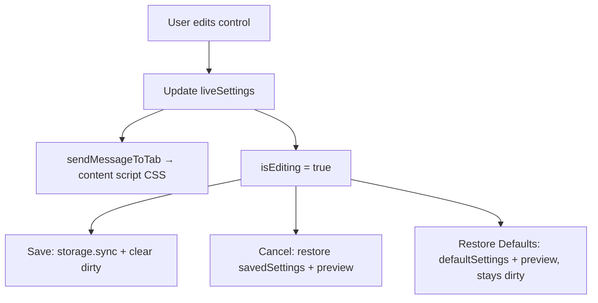

# Features and Settings

User-facing behavior and how settings become CSS on ChatGPT. Architecture context: [architecture.md](architecture.md).

## Active features

| Feature                          | Where                        | Behavior                                                                      |
| -------------------------------- | ---------------------------- | ----------------------------------------------------------------------------- |
| Message width                    | MessageEditor sliders        | `%` max-width on conversation turns                                           |
| Message padding                  | MessageEditor sliders        | `px` padding on message containers                                            |
| Message border radius            | MessageEditor sliders        | `px` border-radius                                                            |
| Input box width                  | MessageEditor sliders        | `%` max-width on `form`                                                       |
| User / ChatGPT bubble colors     | ColorControls                | Background colors for odd/even turns                                          |
| User / ChatGPT text colors       | ColorControls                | Text colors for user vs assistant content                                     |
| Restore defaults / Save / Cancel | FormButtons                  | Reset preview, persist immediately, or restore the last saved/loaded settings |
| Delete all conversations         | DeleteAllChatsButton         | DOM automation on the active ChatGPT tab                                      |
| Scroll to top                    | Content script + ScrollToTop | Floating button when the thread is scrolled                                   |
| Layout cleanup                   | `removeUnnecessarySpace`     | Removes classes that constrain width / alignment                              |
| Fixed CSS helpers                | `stylingFunctions`           | Content width-cap removal, light-mode submit button color, and related helpers |

## Settings model

The domain model and defaults are colocated in [`src/shared/settings.ts`](../src/shared/settings.ts):

```ts
interface Settings {
    messageMaxWidthStyle: string;
    messageColorUserStyle: string;
    messageColorNonUserStyle: string;
    messagePaddingStyle: string;
    messageBorderRadiusStyle: string;
    inputBoxMaxWidthStyle: string;
    textColorUserStyle: string;
    textColorNonUserStyle: string;
}
```

| Key                        | Default     |
| -------------------------- | ----------- |
| `messageMaxWidthStyle`     | `"95"`      |
| `messageColorUserStyle`    | `"#0084FF"` |
| `messageColorNonUserStyle` | `"#333333"` |
| `messagePaddingStyle`      | `"10"`      |
| `messageBorderRadiusStyle` | `"5"`       |
| `inputBoxMaxWidthStyle`    | `"94"`      |
| `textColorUserStyle`       | `"#FFFFFF"` |
| `textColorNonUserStyle`    | `"#FFFFFF"` |

Storage key: `options` in `chrome.storage.sync`. Stored values are merged over `defaultSettings`, so missing keys from older installs receive current defaults.

## Live preview vs Save / Cancel / Defaults

State lives in `Popup` as `liveSettings` / `setLiveSettings`, passed into MessageEditor.



### Control behavior

-   **Sliders** ([`MessageSliderControls`](../src/popup/views/messageEditor/components/messageSliderControls/MessageSliderControls.tsx)): numeric text + range inputs (1–100). Digits only; values capped at 100. Each change calls `sendMessageToTab` and marks editing.
-   **Colors** ([`ColorControls`](../src/popup/views/messageEditor/components/colorControls/ColorControls.tsx)): HTML color inputs for User and ChatGPT × (BG, Text). Same live-update pattern.
-   **FormButtons** ([`FormButtons.tsx`](../src/components/formButtons/FormButtons.tsx)):
    -   **Restore Defaults** — set live state to `defaultSettings`, preview via `sendMessageToTab(defaultSettings)`, leave `isEditing` true.
    -   **Save** — `saveOptionsToStorage(liveSettings)`, copy into `savedSettings`, clear editing.
    -   **Cancel** — restore the settings last loaded from storage or explicitly saved, preview them, and clear editing.
-   **Background disconnect** — closing the popup intentionally persists the latest live settings, even without clicking Save. The Save button provides an immediate persistence option while the popup remains open.

The popup does not forward its initial defaults to the background until storage finishes loading. This prevents a quick open/close from overwriting stored settings with defaults.

## CSS generation

[`src/shared/utils/stylingFunctions.ts`](../src/shared/utils/stylingFunctions.ts) is the single place settings become CSS.

1. `buildCss(settings)` is a **pure** function: the returned CSS string depends only on the provided `Settings` object (no module-level mutable fragments).
2. Fixed helper rules (content width-cap removal, turn sizing helpers, light-mode submit button color) are always included.
3. Primary selector root: `[data-testid^="conversation-turn-"]`.
    - User turns: `[data-turn="user"]`
    - Assistant turns: `[data-turn="assistant"]`

`updateStyles(settings)` remains as a thin alias of `buildCss` for compatibility.

### Messaging helper

`sendMessageToTab(settings)`:

-   Builds CSS via `buildCss(settings)`.
-   Sends `{ action: "updateStyles", arg: cssString }` to the active tab.
-   Live controls always pass the **full updated settings object** (not a single key), so previews never depend on prior call history.

Content script applies `arg` as `customStyle.textContent` — it does not re-parse settings for live updates. On page load it uses `buildCss(settings)` from storage.

## Scroll to top

[`src/components/scrollToTop/ScrollToTop.tsx`](../src/components/scrollToTop/ScrollToTop.tsx), mounted by the content script:

-   Finds ChatGPT’s scroll container via `[data-scroll-root]`.
-   Mounts beside the native scroll-to-bottom control under `#thread-bottom-container`.
-   Shows a circular button when `scrollTop !== 0`.
-   Smooth-scrolls to top; hides the button while scrolling.

Remount logic runs on a 1s interval so SPA navigations between chats still get the button. If ChatGPT replaces the scroll container, the old mount is removed and a fresh `ScrollToTop` is attached.

## Delete all conversations

UI: [`DeleteAllChatsButton`](../src/components/deleteAllChatsButton/DeleteAllChatsButton.tsx).

1. User confirms (Yes / No).
2. Active tab hostname must be `chatgpt.com` (or a subdomain).
3. Message `{ action: "deleteMessages" }` → content script → async [`deleteAllChats()`](../src/lib/utilities/deleteAllChats.ts).
4. Content script waits (with timeout) for each ChatGPT UI step, then responds SUCCESS/FAILURE.
5. Popup shows that result — it does **not** claim success just because the message was sent.

Treat this feature as **fragile**; selector failures are expected after ChatGPT UI updates. See [dom-integration.md](dom-integration.md).

## Adding a new setting (checklist)

1. Add the field and default to `Settings` / `defaultSettings` in `src/shared/settings.ts`.
2. Extend `buildCss` / dynamic style fragments to emit CSS for the new field.
3. Add UI control that updates `liveSettings` and calls `sendMessageToTab` with the full updated settings object.
4. Update tests/snapshots.
5. Manual pass: live preview, Save, page reload, Cancel, Restore Defaults.

## Related docs

-   [architecture.md](architecture.md)
-   [dom-integration.md](dom-integration.md)
-   [../CLAUDE.md](../CLAUDE.md)
